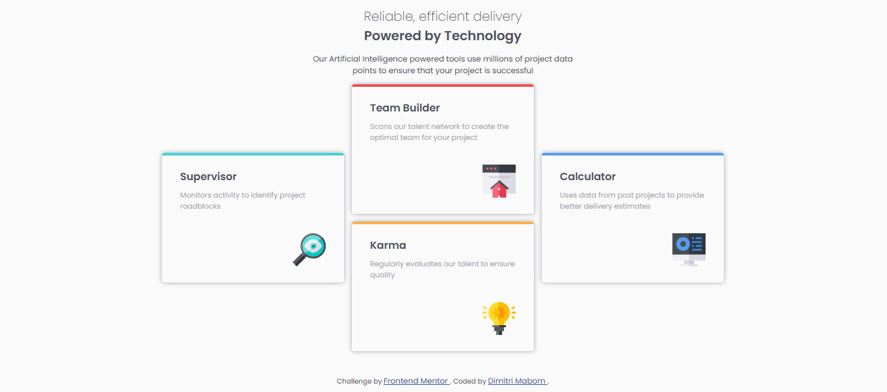

# Frontend Mentor - Four card feature section solution

This is a solution to the [Four card feature section challenge on Frontend Mentor](https://www.frontendmentor.io/challenges/four-card-feature-section-weK1eFYK). Frontend Mentor challenges help you improve your coding skills by building realistic projects.

## Table of contents

- [Overview](#overview)
  - [Screenshot](#screenshot)
  - [Links](#links)
- [My process](#my-process)
  - [Built with](#built-with)
  - [What I learned](#what-i-learned)
  - [Useful resources](#useful-resources)
- [Author](#author)

## Overview

### Screenshot



### Links

- Solution URL: [https://github.com/dimitrimabom/four-card-feature-section.git](https://github.com/dimitrimabom/four-card-feature-section.git)
- Live Site URL: [https://four-card-feature-section-v403.onrender.com/](https://four-card-feature-section-v403.onrender.com/)

## My process

### Built with

- Semantic HTML5 markup
- CSS custom properties
- Flexbox
- Grid
- SCSS

### What I learned

I've rediscovered how grids work. what caused me a bit of trouble was aligning the blocks with the grids. this code helped me a lot.

```css
.cards {
  grid-template-areas:
    "card_1 card_2 card_4"
    "card_1 card_3 card_4";
}
```

### Useful resources

- [Free Host - render.com](https://render.com/) - Our fastest path to production
  Build, deploy, and scale your apps with unparalleled ease – from your first user to your billionth.
- [SCSS Docs](https://sass-lang.com/guide/) - Install Sass and learn out to use.

## Author

- Website - [Dimitri Mabom](https://github.com/dimitrimabom)
- Frontend Mentor - [@dimitrimabom](https://www.frontendmentor.io/profile/dimitrimabom)
- Linkedin - [Dimitri Mabom](https://www.linkedin.com/in/dimitri-mabom/)
